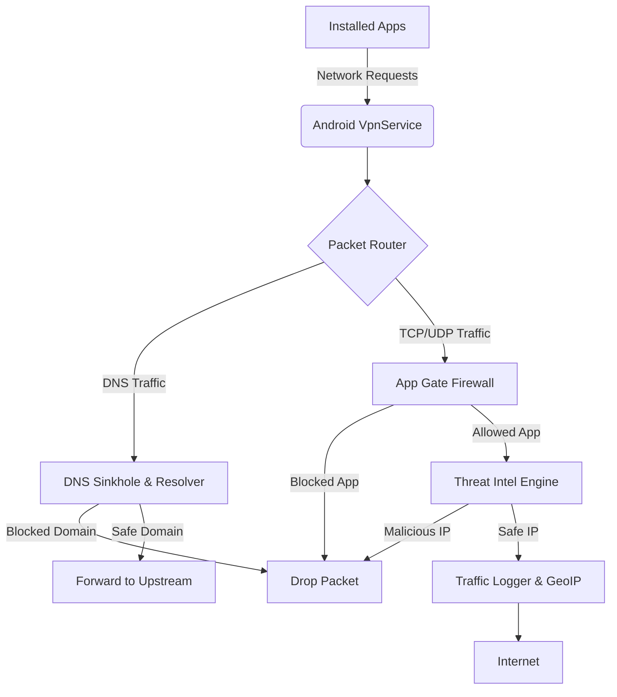

<div align="center">
  <h1>🛡️ GateKeeper Mobile</h1>
  <p><b>The Ultimate Standalone Mobile Security Suite for Android</b></p>
  <p><i>Combining per-app firewall, DNS filtering, traffic monitoring, and intelligent threat detection into one powerful application.</i></p>

  [](https://kotlinlang.org)
  [](https://developer.android.com/jetpack/compose)
  [](https://www.android.com/)
  []()
</div>

---

## 📖 Table of Contents
- [🌟 Overview](#-overview)
- [✨ Features](#-features)
  - [1. 🌐 Network Protection](#1--network-protection)
  - [2. 🕵️ Privacy & Data Security](#2-️-privacy--data-security)
  - [3. 🚨 Threat Detection](#3--threat-detection)
  - [4. 📊 Monitoring & Forensics](#4--monitoring--forensics)
- [🛠️ Tech Stack & Architecture](#️-tech-stack--architecture)
- [⚙️ Getting Started](#️-getting-started)
- [🔗 Standalone Protection](#-standalone-protection)
- [📸 Screenshots](#-screenshots)

---

## 🌟 Overview

**GateKeeper Mobile** is a comprehensive, standalone security suite designed for modern Android devices. Built completely with **Jetpack Compose** and following Clean Architecture principles, it acts as your personal, on-device security operations center.

By utilizing Android's native `VpnService` API, GateKeeper intercepts network traffic locally on your device. This allows for system-wide firewalling, DNS filtering, and threat detection **without requiring root access** or sending your data to a cloud server. 

Everything happens on your device, ensuring maximum privacy and minimal latency.

---

## ✨ Features

Based on cutting-edge network security principles, GateKeeper offers tools usually reserved for enterprise environments.

### 1. 🌐 Network Protection
* **App Gate (Per-App Firewall)**: Granularly control which applications can access Wi-Fi or Mobile Data natively.
* **Web Gate (DNS Sinkhole)**: Block dangerous websites, ads, and trackers at the network level before they load. Enforces **Safe Search** automatically.
* **Screen-Off Blocking**: Stop background data transmission for selected apps when your device is locked.
* **DNS Privacy Guard**: Prevent rogue apps from bypassing the DNS filter using encrypted DNS-over-HTTPS.
* **Bypass Attempt Detector**: Get alerted if a blocked app tries to connect using hardcoded IP addresses.

### 2. 🕵️ Privacy & Data Security
* **Privacy Logs & Permission Auditor**: Analyzes installed apps, scores their risk based on declared permissions, and tracks sensor usage.
* **Secret Data Leak Detector**: Uses Shannon entropy to detect data exfiltration attempts tunneled through DNS queries.
* **Background Camera/Mic Alerts**: Get instant notifications when apps try to secretly access your camera or microphone in the background.
* **Global Camera Block**: System-wide camera disable switch (requires Device Admin).

### 3. 🚨 Threat Detection
* **Threat Intel (IDS/IPS)**: Cross-references all active connections with public threat intelligence feeds to instantly drop malicious packets.
* **Wi-Fi Guard & Evil Twin Detector**: Evaluates Wi-Fi security and detects duplicate APs trying to steal your connection.
* **IMSI Catcher Detector**: Monitors for suspicious 2G network downgrades indicating a potential Stingray or Fake Cell Tower attack.
* **Trust Check (Certificate Auditor)**: Scans user-installed CA certificates to identify known MITM proxies, expired, or rogue certificates.

### 4. 📊 Monitoring & Forensics
* **NetWatch (Live Traffic Monitor)**: Visualize network activity with live bandwidth tracking, GeoIP country resolution, and detailed per-app connection logs.
* **PCAP Traffic Capture**: Record raw packets to `.pcap` files directly from your phone for advanced Wireshark analysis.
* **Export Utilities**: Export your traffic logs as CSV or your firewall rules as JSON for external review.

---

## 🛠️ Tech Stack & Architecture

GateKeeper is built with modern Android development best practices, using an MVVM architecture powered by Hilt and Coroutines.

### Technologies
| Category | Technologies Used |
|---|---|
| **Language** | Kotlin 2.1 |
| **UI Framework** | Jetpack Compose (Material 3) |
| **Dependency Injection** | Hilt (Dagger) |
| **Local Storage** | Room (SQLite), DataStore |
| **Networking/API** | Retrofit, OkHttp |
| **Charting** | Vico Charts |
| **Security Engine** | Android `VpnService`, TUN Interface, Custom Packet Filter |
| **Asynchrony** | Coroutines & Flow |

### Architecture Flow



---

## ⚙️ Getting Started

For detailed tool versions and environment setups, please refer to [REQUIREMENTS.md](REQUIREMENTS.md).

### Prerequisites
* **IDE**: Android Studio Ladybug (2024.2+)
* **Java**: JDK 17
* **Device**: Physical Android Device running **Android 8.0+** (API 26+)

### Installation & Build

1. Clone the repository and open the project in Android Studio.
   ```bash
   git clone https://github.com/M-Fahim-Feroz/GateKeeper-Mobile.git
   ```
2. Allow Gradle to sync the project dependencies.
3. Enable **USB Debugging** on your physical Android device and connect it to your machine.
   > **Note:** Android emulators often fail to route packets through custom VPN interfaces correctly. Physical devices are highly recommended for accurate testing.
4. Click **Run 'app'** in Android Studio to deploy to your device.

---

## 🔗 Standalone Protection

GateKeeper Mobile is a fully self-contained application. All features including the firewall, DNS sinkhole, and traffic logging work entirely on-device, providing robust and independent protection **without relying on any external desktop application, central server, or cloud synchronization.** Your data stays yours.

---

## 📸 Screenshots

*(Add screenshots of the Dashboard, Firewall settings, and Traffic Charts here once available)*

---

<div align="center">
  <p>Built as part of an Advanced Network Security Final Year Project.</p>
</div>
