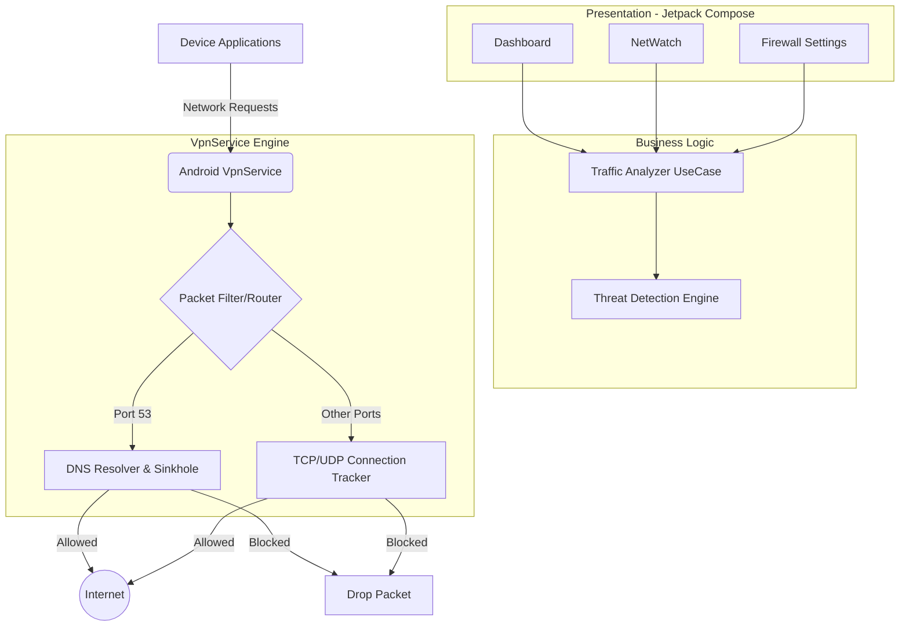

<div align="center">
  <picture>
    <source media="(prefers-color-scheme: dark)" srcset="public/Dark%20Mode%20logo.png">
    
  </picture>
  
  # 🛡️ GateKeeper Mobile
  
  **An advanced, standalone Android security suite built to detect, prevent, and analyze network threats natively.**

  [](https://kotlinlang.org)
  [](https://developer.android.com/jetpack/compose)
  []()
  [](LICENSE)

  *No root required • 100% On-Device Processing • Zero Cloud Dependency*

  ---
  
  [Overview](#-overview) • [Technical Highlights](#-technical-highlights) • [Features](#-core-features) • [Architecture](#️-system-architecture) • [Getting Started](#️-getting-started)
</div>

---

## 💡 Overview

Mobile security applications often rely on remote servers to analyze traffic or require rooted devices to enforce strict firewall rules. **GateKeeper Mobile challenges this paradigm.** 

Built as a comprehensive Final Year Project in Advanced Network Security, GateKeeper leverages Android's `VpnService` to create a powerful, system-wide local network sinkhole. It intercepts, analyzes, and filters packets entirely on-device, offering enterprise-grade security features like per-app firewalling, DNS filtering, and live packet inspection without compromising user privacy or device performance.

## 🚀 Technical Highlights

This project was built not just to function, but to demonstrate modern Android development best practices and advanced networking concepts:

* **Custom Packet Interception**: Engineered a local `VpnService` implementation that routes and inspects raw TCP/UDP packets.
* **On-Device Threat Intelligence**: Implemented local databases and Bloom filters to instantly cross-reference active connections against known malicious IPs and domains.
* **Modern Android UI**: Designed a sleek, fluid, and dark-mode optimized user interface using **Jetpack Compose** and Material 3 design guidelines.
* **Reactive Architecture**: Built strictly on **Clean Architecture** using Kotlin Coroutines, Flow, and Hilt for robust dependency injection and state management.
* **Forensic Capabilities**: Integrated raw PCAP file generation directly on the mobile device, allowing network analysts to export and study traffic in Wireshark.

---

## ✨ Core Features

### 🌐 Advanced Network Control
* **App Gate (Per-App Firewall)**: Granularly block or allow Wi-Fi and Mobile Data for individual applications. Includes an aggressive "Screen-Off" blocking mode to prevent background data leakage.
* **Web Gate (DNS Sinkhole)**: Intercepts DNS queries to block malicious domains, trackers, and intrusive ads before the connection is ever made. Automatically enforces Safe Search.
* **DNS Privacy Guard**: Actively prevents applications from bypassing local filters via hardcoded DNS-over-HTTPS (DoH) servers.

### 🚨 Active Threat Detection
* **Real-Time Threat Intel**: Cross-references connections with active threat feeds to drop packets destined for known Command & Control (C2) servers.
* **Evil Twin & Wi-Fi Guard**: Scans wireless networks to detect duplicate or spoofed Access Points attempting to execute Man-in-the-Middle (MITM) attacks.
* **IMSI Catcher Detection**: Monitors cellular radio states to alert the user of suspicious 2G downgrades (Stingray attacks).
* **Certificate Auditor**: Analyzes the device's Trust Store for rogue or expired CA certificates.

### 🕵️ Privacy Enforcement
* **Exfiltration Detection**: Employs Shannon entropy analysis on DNS queries to detect hidden data exfiltration tunnels.
* **Permission Auditor**: Scores installed applications based on their requested sensitive permissions and background behaviors.
* **Hardware Alerts**: Triggers notifications when applications silently access the camera or microphone in the background.

### 📊 Forensics & Observability
* **NetWatch Dashboard**: Live, visual bandwidth tracking and per-application connection logs utilizing Vico Charts.
* **GeoIP Resolution**: Maps IP addresses to their origin countries using local MaxMind databases.
* **PCAP Export**: Capture and export raw network traffic packets for deep analysis.

---

## 🏗️ System Architecture

GateKeeper is structured into distinct, scalable layers ensuring separation of concerns:



---

## 🎨 UI & UX Design

<div align="center">
  <table>
    <tr>
      <td align="center"><br/><b>Dashboard</b></td>
      <td align="center"><br/><b>NetWatch</b></td>
      <td align="center"><br/><b>Threat Intel</b></td>
    </tr>
    <tr>
      <td align="center"><br/><b>App Gate</b></td>
      <td align="center"><br/><b>Web Gate</b></td>
      <td align="center"><br/><b>Privacy Dashboard</b></td>
    </tr>
  </table>
  <p><i>The interface prioritizes critical information delivery while maintaining a premium, vibrant aesthetic.</i></p>
</div>

---

## 🛠️ Tech Stack

* **Language**: Kotlin 2.1
* **UI**: Jetpack Compose (Material 3), Vico Charts
* **Architecture**: Clean Architecture + MVVM
* **Dependency Injection**: Hilt
* **Asynchronous Programming**: Kotlin Coroutines & Flow
* **Local Data**: Room (SQLite), DataStore Preferences
* **Networking**: Retrofit2, OkHttp3
* **Core API**: Android `VpnService`

---

## ⚙️ Getting Started

To explore the codebase or run the application locally:

1. **Clone the repository:**
   ```bash
   git clone https://github.com/M-Fahim-Feroz/GateKeeper-Mobile.git
   ```
2. **Open in Android Studio:** 
   Ensure you are using Android Studio Ladybug (2024.2+) and JDK 17.
3. **Build & Run:** 
   Connect a physical Android device (Android 8.0+). *Note: VPN functionality often behaves unpredictably on emulators due to nested routing.*

For further environment details, check [REQUIREMENTS.md](REQUIREMENTS.md).

---

<div align="center">
  <b>Built with passion for network security and modern Android development.</b>
</div>
